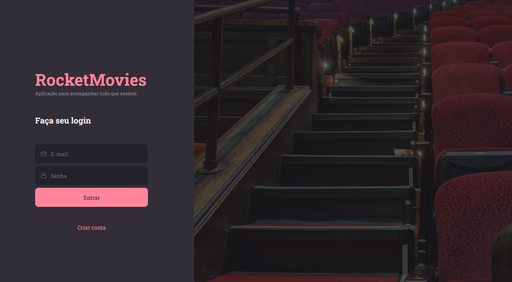
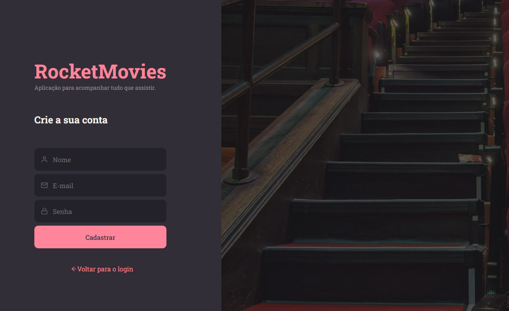
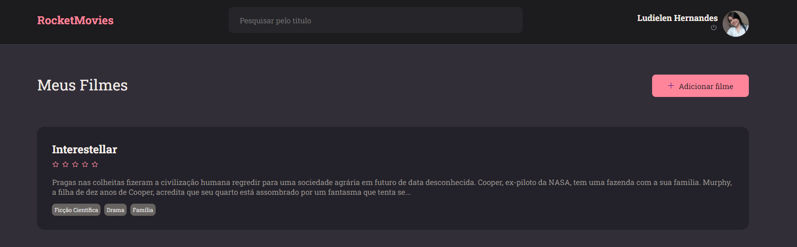
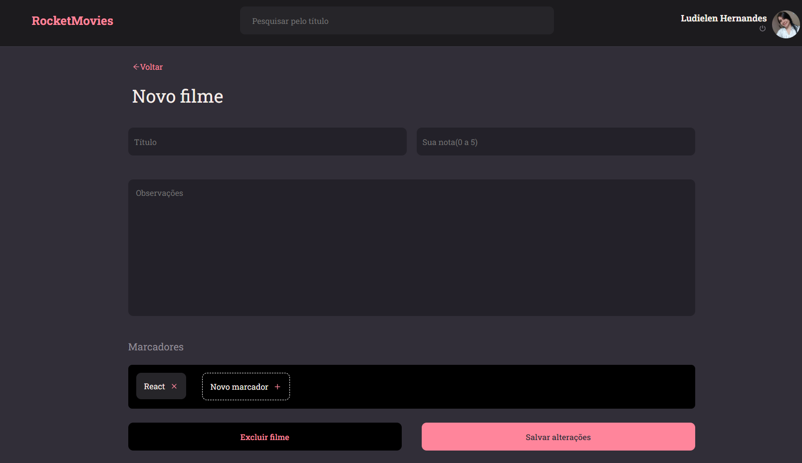
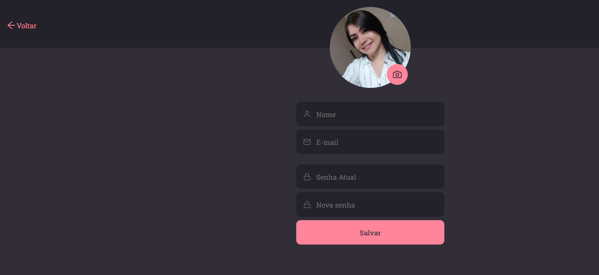

# Movie Notes App - Desafio Frontend

Um aplicativo desenvolvido como parte do curso da Rockeatseat, com o objetivo de criar uma plataforma para adicionar e gerenciar notas de filmes usando React.

# ferramenta utilizada vite.
# biblioteca react router dom.

## Capturas de tela

Aqui estão algumas capturas de tela do Movie Notes App em ação. 

